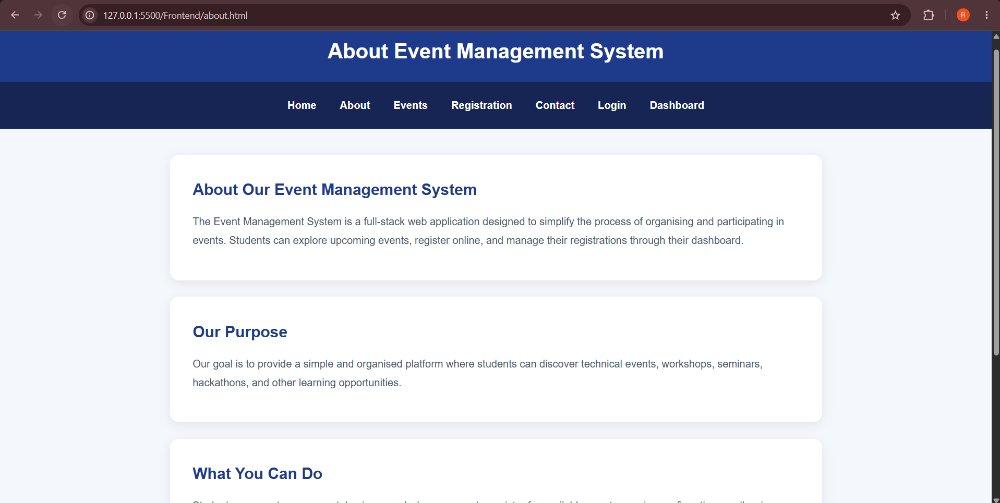
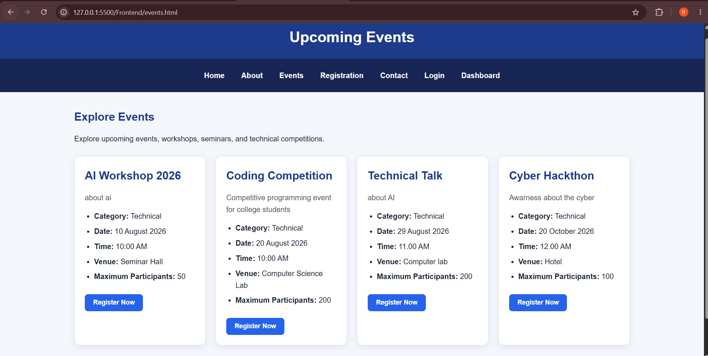
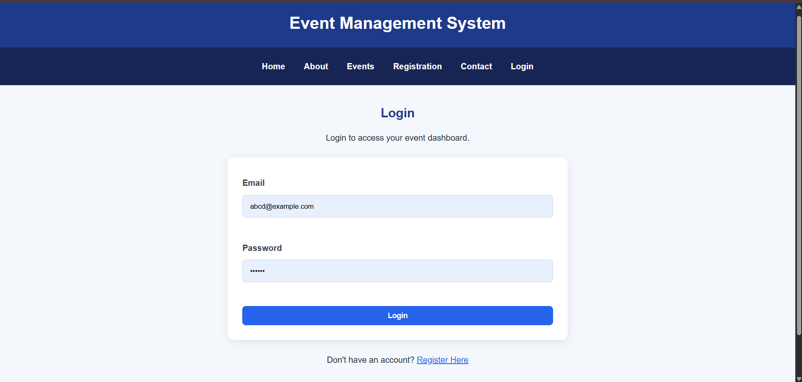
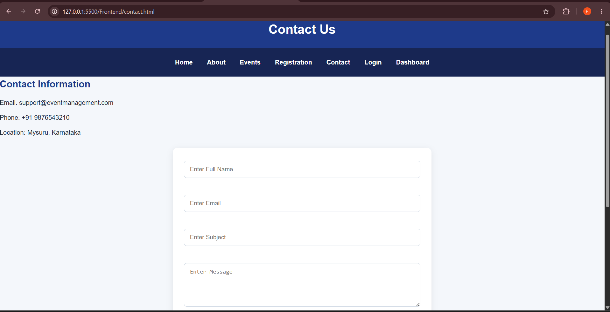

# Event Management System

A full-stack Event Management System developed as part of the **Code-A-Nova Full Stack Development Internship**.

The application allows students to create accounts, log in, explore upcoming events, register for events, receive email confirmations, view their registrations, and cancel registrations.

Administrators can manage events and monitor student registrations through an admin dashboard.

---

## Features

### Student Features

- Student account registration
- Secure login
- Browse upcoming events
- View event information
- Register for events
- Prevent duplicate registrations
- Registration deadline validation
- Event capacity validation
- Email confirmation after successful registration
- View registered events
- Cancel event registration
- Student dashboard

### Admin Features

- Admin authentication
- Admin dashboard
- View total students
- View total events
- View active registrations
- View cancelled registrations
- Add new events
- Edit existing events
- Delete events
- View student registrations
- Monitor registration status

---

## Technologies Used

### Frontend

- HTML5
- CSS3
- JavaScript
- Fetch API

### Backend

- Node.js
- Express.js
- REST API
- JWT Authentication
- bcryptjs

### Database

- MongoDB
- MongoDB Atlas
- Mongoose

### Other Tools

- Nodemailer
- Git
- GitHub
- Visual Studio Code
- Live Server

---

## Project Structure

```text
Event-Management-System/
│
├── Event Backend/
│   ├── config/
│   │   ├── db.js
│   │   └── email.js
│   │
│   ├── controllers/
│   │   └── authController.js
│   │
│   ├── middleware/
│   │   ├── adminMiddleware.js
│   │   └── authMiddleware.js
│   │
│   ├── models/
│   │   ├── Event.js
│   │   ├── Registration.js
│   │   └── User.js
│   │
│   ├── routes/
│   │   ├── adminRoutes.js
│   │   ├── authRoutes.js
│   │   ├── eventRoutes.js
│   │   └── registrationRoutes.js
│   │
│   ├── package.json
│   └── server.js
│
├── Frontend/
│   ├── css/
│   │   └── style.css
│   │
│   ├── js/
│   │   ├── app.js
│   │   ├── dashboard.js
│   │   ├── events.js
│   │   ├── login.js
│   │   ├── register.js
│   │   ├── registration.js
│   │   └── student-dashboard.js
│   │
│   ├── index.html
│   ├── about.html
│   ├── events.html
│   ├── contact.html
│   ├── login.html
│   ├── register.html
│   ├── registration.html
│   ├── dashboard.html
│   └── student-dashboard.html
│
├── images/
├── screenshots/
├── .gitignore
└── README.md
```

---

## Authentication

The system uses **JSON Web Tokens (JWT)** for authentication.

After a successful login, the generated token is used when accessing protected backend routes.

Role-based access control separates:

- Student functionality
- Administrator functionality

---

## Event Registration Process

1. Student creates an account.
2. Student logs in.
3. Student browses available events.
4. Student selects **Register Now**.
5. The backend validates the user and event.
6. The system checks the registration deadline.
7. Duplicate registrations are prevented.
8. Event capacity is checked.
9. Registration is stored in MongoDB.
10. A confirmation email is sent to the student.
11. The event appears on the student's dashboard.

---

## Email Confirmation

The project uses **Nodemailer** to send a confirmation email after successful event registration.

The email includes event information such as:

- Event name
- Date
- Time
- Venue

Email credentials are stored in environment variables and are not committed to GitHub.

---

## Environment Variables

Create a `.env` file inside the backend directory.

Example:

```env
PORT=3000

MONGO_URI=your_mongodb_connection_string

JWT_SECRET=your_jwt_secret

EMAIL_USER=your_email_address

EMAIL_PASS=your_email_app_password
```

> Do not commit the `.env` file to GitHub.

---

## Installation

Clone the repository:

```bash
git clone https://github.com/ramyanagesh29/Code-A-Nova-Event-Management-System-Full-Stack.git
```

Open the project:

```bash
cd Code-A-Nova-Event-Management-System-Full-Stack
```

Open the backend directory:

```bash
cd "Event Backend"
```

Install dependencies:

```bash
npm install
```

Create the `.env` file and configure the required environment variables.

Start the backend:

```bash
node server.js
```

The API will run on:

```text
http://localhost:3000
```

Open the frontend using **Live Server** or another local web server.

---

## API Overview

### Authentication

```text
POST /api/auth/register
POST /api/auth/login
```

### Events

```text
GET    /api/events
POST   /api/events
PUT    /api/events/:id
DELETE /api/events/:id
```

### Registrations

```text
POST /api/registrations/:eventId
GET  /api/registrations/my/events
PUT  /api/registrations/:registrationId/cancel
GET  /api/registrations
```

### Admin

Admin-specific routes are available under:

```text
/api/admin
```

---

## Screenshots

### Home Page


### About Page



### Events Page



### Login Page



### Contact Page



### Admin Dashboard


### Student Registrations


---

## Security

- Passwords are hashed before being stored.
- JWT is used for authenticated requests.
- Protected routes require authentication.
- Admin routes use role-based authorisation.
- Environment variables protect database and email credentials.
- `.env` and `node_modules` are excluded from Git.

---

## Future Improvements

- Event search and filtering
- Event images
- Forgot password functionality
- Registration certificates
- Attendance tracking
- Improved admin reports
- Cloud deployment

---

## Internship Project

This project was developed as part of the **Code-A-Nova Full Stack Development Internship**.

**Domain:** Full Stack Development  
**Project:** Event Management System

---

## Author

**Ramya N**

Full Stack Development Intern  
Code-A-Nova
